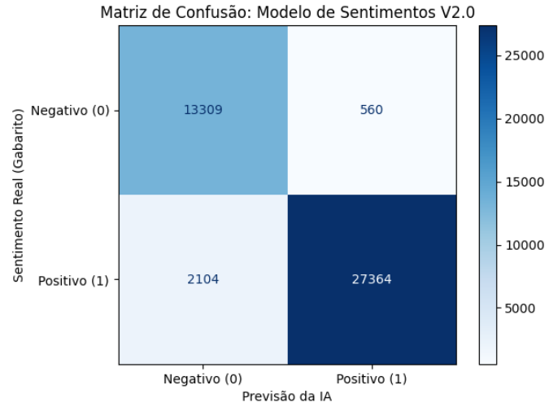
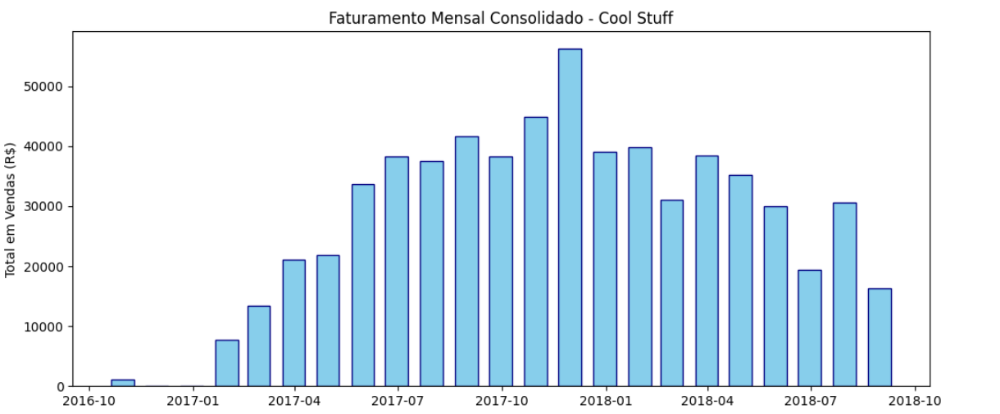

# Análise de Sentimentos e Performance Olist - Versão 2.0

## 📝 Descrição do Projeto
Este projeto utiliza Machine Learning para classificar o sentimento de avaliações de clientes e analisar tendências de faturamento da Olist. A versão 2.0 foca na correção de vieses lógicos e na entrega de métricas visuais precisas para tomada de decisão.

## 📊 Performance do Modelo

### Matriz de Confusão
A matriz abaixo demonstra a eficácia do modelo em identificar críticas reais. Com o uso de **Bigramas** e **Pesos Balanceados**, reduzimos drasticamente os falsos positivos, garantindo que frases como "não é bom" sejam classificadas corretamente.

## 💰 Análise de Faturamento Mensal
Além do sentimento, o projeto analisa a saúde financeira através do faturamento mensal. O gráfico abaixo consolida o desempenho de vendas ao longo do período analisado.

## 🛠️ Evolução Técnica (V1 vs V2)
* **Acurácia:** Elevada de 47% para **93.85%**.
* **Tratamento de Contexto:** Implementação de `ngram_range=(1, 2)` para leitura de frases negativas compostas.
* **Equilíbrio de Dados:** Uso de `class_weight='balanced'` para compensar a base majoritariamente positiva.
* **Persistência:** Modelo e vetorizador serializados em arquivos `.pkl` para uso em produção.

## 📂 Estrutura
* `01_Carregamento_Limpeza.ipynb`: Tratamento da base original.
* `02_Analise_Exploratória.ipynb`: Investigação de métricas de negócio, tendências de faturamento e insights sobre o comportamento de compra.
* `03_Classificacao.ipynb`: Treino e métricas do modelo.
* `04_Aplicacao.ipynb`: Simulador interativo de sentimentos.

# Tecnologias Utilizadas
Python

Pandas / Scikit-Learn

NLTK (Natural Language Toolkit)

Joblib (Persistência de modelos)

Matplotlib / Seaborn

Status: Concluído

---
